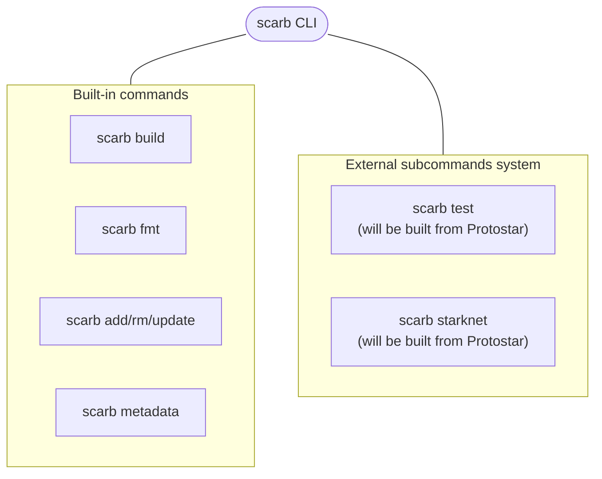
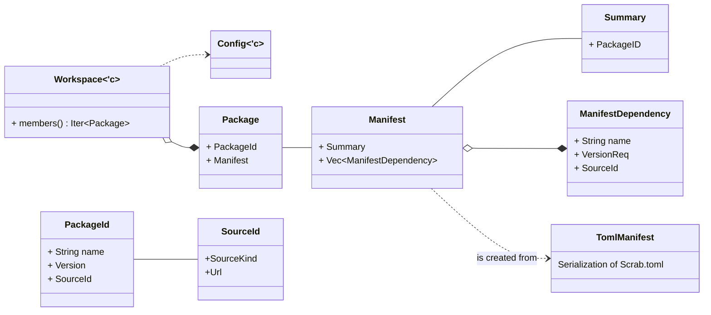

# Scarb Architecture

This document describes the high-level architecture of Scarb.
If you want to familiarize yourself with the code base, you are just in the right place!

Some parts are not implemented, yet already documented in present tense, to outline what is expected to be developed.

## Bird's Eye View

Scarb is a command-line application which works as an entrypoint for working with [Cairo] projects.

The command line interface is just a thin wrapper over functionality provided by the `scarb` Rust crate.
This crate consist of primarily two modules:

1. `core` - contains all data structures representing project model and workspace state.
   Use these only for read operations.
   See the [Data model](#data-model) section for more information.
2. `ops` (_operations_) - contains functions for performing all kinds of mutations of the project.
   If you are looking for a function to resolve packages, build the project
   or modify `Scarb.toml` - this is the place to look at.

## Package management

### Core data model

### Sources and the internal registry

**THIS IS NOT FULLY IMPLEMENTED YET.**

A _source_ is an object that finds and downloads remote packages based on names and versions.
The interface of sources is contained within the `Source` trait.
There are various `Source` implementation for different methods of downloading packages:

1. `PathSource` simply provides an ability to operate on packages from local file system.
2. `GitSource` downloads packages from Git repositories.
3. `RegistrySource` downloads packages from package registries.
4. And more...

The `Registry` object gathers all `Source` objects in a single mapping, and provides a unified interface for querying
_any_ package, no matter of its source.

### Version solver

Version solving consists in efficiently finding a set of packages and versions that satisfy all the constraints of a
given project dependencies.

**THIS IS NOT IMPLEMENTED YET.**

Scarb uses [PubGrub][pubgrub-algo-docs] algorithm for version resolution.
It is known for having both good performance and providing human-understandable explanations of failures.
Algorithm implementation is provided by the [`pubgrub`][pubgrub-crate] crate,
thanks to which this project does not have to maintain custom solver implementation.

The solver implementation does not cache queries it creates, so logically it would have to talk **a lot** with
the `Registry` object, asking relatively for same queries or downloads.
In order to prevent this, the solver operates on the `RegistryCache` object, which manages caching and parallelism
internally.

### Lockfile

**THIS IS NOT IMPLEMENTED YET.**

      TODO(mkaput): Write this section.

## Scarb Compiler

The `scarb build` command compiles all workspace members and produces outputs in the `target` directory.
The Cairo compiler is used as a crate, which means that it is compiled into the Scarb binary itself and thus,
**Scarb is tightly bound to specific Cairo version**.
The entire compilation process is contained within the `ops::compile` op.

### Cairo `core`

Because Cairo compiler is built-in, an important problem is how to install Cairo's standard library, `core`,
on users' machines.

The `core` is treated as a regular package, that is _injected_ to all packages as a dependency under the hood.
This package has a special source ID, which maps to the `CoreSource` implementation.
A side effect of this approach is that `core` is included in the lockfile.

### Targets

**THIS IS NOT IMPLEMENTED YET.**

      TODO(mkaput): Write this section.

[pubgrub-algo-docs]: https://nex3.medium.com/pubgrub-2fb6470504f

[pubgrub-crate]: https://github.com/pubgrub-rs/pubgrub

[cairo]: https://cairo-lang.org
