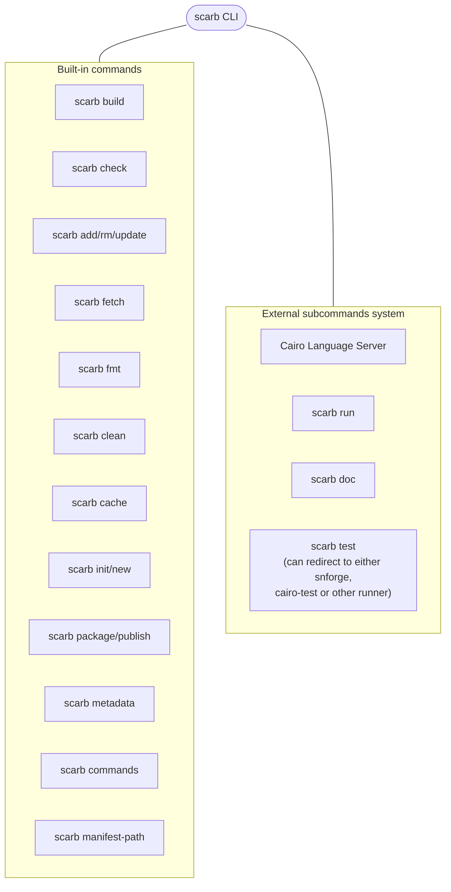
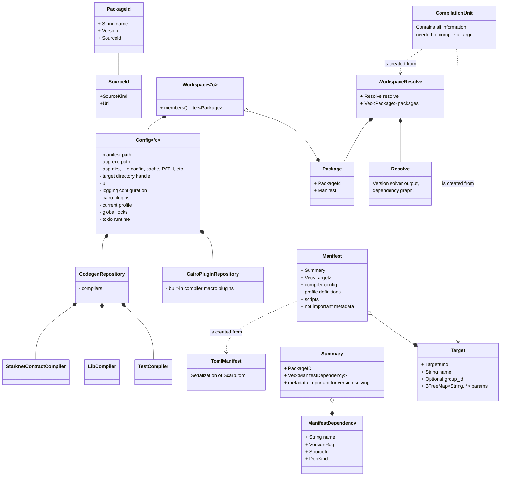
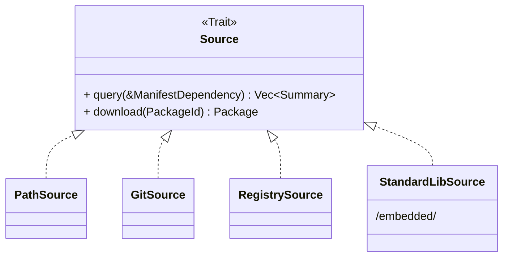

# Scarb Architecture

This document describes the high-level architecture of Scarb.
If you want to familiarize yourself with the code base, you are just in the right place!

Some parts are not implemented, yet already documented in present tense, to outline what is expected to be developed.

## Bird's Eye View

Scarb is a command-line application which works as an entrypoint for working with [Cairo] projects.

The command line interface is just a thin wrapper over functionality provided by the `scarb` Rust crate.
This crate consist of primarily two modules:

1. `core` - contains all data structures representing project model and workspace state.
   Use these only for read operations.
   See the [Core data model](#core-data-model) section for more information.
2. `ops` (_operations_) - contains functions for performing all kinds of mutations of the project.
   If you are looking for a function to resolve packages, build the project
   or modify `Scarb.toml` - this is the place to look at.

## Package management

### Core data model

### Sources and the internal registry

A _source_ is an object that finds and downloads remote packages based on names and versions.
The interface of sources is contained within the `Source` trait.
There are various `Source` implementation for different methods of downloading packages:

1. `PathSource` simply provides an ability to operate on packages from local file system.
2. `GitSource` downloads packages from Git repositories.
3. `RegistrySource` downloads packages from package registries.
4. `StandardLibSource` unpacks packages embedded into the Scarb binary itself.
4. And more...

The `Registry` object gathers all `Source` objects in a single mapping, and provides a unified interface for querying
_any_ package, no matter of its source.

### Version solver

Version solving consists in efficiently finding a set of packages and versions that satisfy all the constraints of a
given project dependencies.

**THIS IS NOT IMPLEMENTED YET.**

Scarb uses [PubGrub][pubgrub-algo-docs] algorithm for version resolution.
It is known for having both good performance and providing human-understandable explanations of failures.
Algorithm implementation is provided by the [`pubgrub`][pubgrub-crate] crate,
thanks to which this project does not have to maintain custom solver implementation.

The solver implementation does not cache queries it creates, so logically it would have to talk **a lot** with
the `Registry` object, asking relatively for same queries or downloads.
In order to prevent this, the solver operates on the `RegistryCache` object, which manages caching and parallelism
internally.

### Lockfile

See Scarb documentation.

## Scarb Compiler

The `scarb build` command compiles all compilation units found in a workspace and produces outputs
in the `target` directory.
The Cairo compiler is used as a crate, which means that it is compiled into the Scarb binary itself and thus,
**Scarb is tightly bound to specific Cairo version**.
The entire compilation process is contained within the `ops::compile` op.

### Cairo `core`

Because Cairo compiler is built-in, an important problem is how to install Cairo's standard library, `core`,
on users' machines.

The `core` is treated as a regular package, that is _injected_ to all packages as a dependency under the hood.
This package has a special source ID, called `std`, which maps to the `StandardLibSource` implementation.
A side effect of this approach is that `core` can be specified in `[dependencies`] and it is included in the lockfile.

`core` library is downloaded from Cairo Git repository in `build.rs` and is embedded into Scarb binary.
`StandardLibSource` extracts it to cache directory. All these operations are lazy, if there is already `core` archive
in `/target/`, `build.rs` will not attempt to re-download it, and if `core` has been extracted to cache, it will not be
overwritten.

### Targets

Compilation targets are defined in the `Package` manifest. 
Each target corresponds to source files which can be compiled into a package, and the way how the package is compiled.
Packages can have a built-in library target, and/or more externally defined targets.
When building a package, each target of this package will use exactly the same set of dependencies during compilation.
By default, if the manifest does not list any targets, Scarb will assume the library target with its default parameters.

Each compilation target consists of target kind, source path and parameters table. 
When building a project, compilation targets are used to construct compilation units.

### CodegenRepository

**Currently referred to as CompilerRepository within the implementation.**

To compile Cairo code while building a project into appropriate output targets, Scarb relies on Cairo compiler crate.
Each compilation target requires the Cairo compiler to be appropriately configured before building the project.  
Scarb defines preconfigured Cairo compiler instances as structs implementing the `Compiler` trait.
You can see `StarknetContractCompiler` as an example of such implementation.

The CompilerRepository is used to manage the variety of preconfigured Cairo compilers available to Scarb.
Each compiler is identified by the target kind that uses it for compilation. 
At any time, there can be only one compiler registered for a specific compilation target kind.
When building a project, Scarb retrieves appropriate compiler implementation from CodegenRepository by target kind.
The compiler will later be used to compile the project into the target output.

### Compilation units
Please see [scarb documentation](https://docs.swmansion.com/scarb/docs/reference/compilation-model.html) for more information.

### CairoPluginRepository

Thanks to the Cairo compiler architecture, the compilation process can be altered in certain ways by use of 
the `MacroPlugin` interface.
Within Scarb, this functionality is exposed to users as Cairo plugins.  
Cairo plugin is a special Scarb package that defines a cairo-plugin target and provides additional interface for 
instantiating compiler Semantic plugins. 
The Cairo plugins can be used in Scarb to expand the capabilities of the Cairo compiler, empowering users to implement
extensions that would only be possible in the compiler codebase before. 

Within Scarb, Cairo plugins are managed through `CairoPluginRepository`, residing in Scarb configuration object.
The plugin repository stores references to all Cairo plugins that are available during the compilation process.
Plugins appropriate to be used for building a specific package are applied to the compiler database before the compilation. 
When using Scarb as a library, Cairo plugins can be defined with configuration builder. 
If not specified otherwise, Scarb comes with predefined StarkNet Cairo plugin, that can be used for StarkNet contracts
compilation.

### Procedural Macros 

Procedural macros provide a mechanism for defining custom macros as package dependencies.
The package with macro source code definition will be pulled and compiled by Scarb.
Please see [the design document](design/01-proc-macro.md) for more information.

### RootDatabase management within the compiler

Cairo compiler relies on the `RootDatabase` for management of the compilation state.
When compiling a single compilation unit, Scarb creates and configures the database, and passes it to the Cairo compiler. 
The compilation of each unit uses a separate database instance, which is then dropped after the compilation is finished.
The database is initialized with Cairo project configuration, obtained from the Scarb compilation unit, conditional 
compilation parameters (see [scarb documentation](https://docs.swmansion.com/scarb/docs/reference/conditional-compilation.html) 
for more information) and active Cairo plugins.

### Profiles implementation

Profiles provide a way to alter the compiler settings from the Scarb manifest file. 
Please see the [scarb documentation](https://docs.swmansion.com/scarb/docs/reference/profiles.html) for general information 
about profile use cases and syntax. 

Overrides imposed by profile definition are applied towards the appropriate settings while converting `TomlManifest` 
(serialization of Scarb manifest file) into the `Manifest` object.  
First, profile definition is read from manifest file, including appropriate profile inheritance attributes.
The full definition of current profile is obtained by merging the parent profile definition with overrides from manifest.
Then, the definition is used to override appropriate setting, e.g. Cairo compiler configuration by merging appropriate 
profile definition sections onto the default configuration.

The merging mentioned above is implemented as a merger of two plain `toml::Value` objects.

[pubgrub-algo-docs]: https://nex3.medium.com/pubgrub-2fb6470504f

[pubgrub-crate]: https://github.com/pubgrub-rs/pubgrub

[cairo]: https://cairo-lang.org
