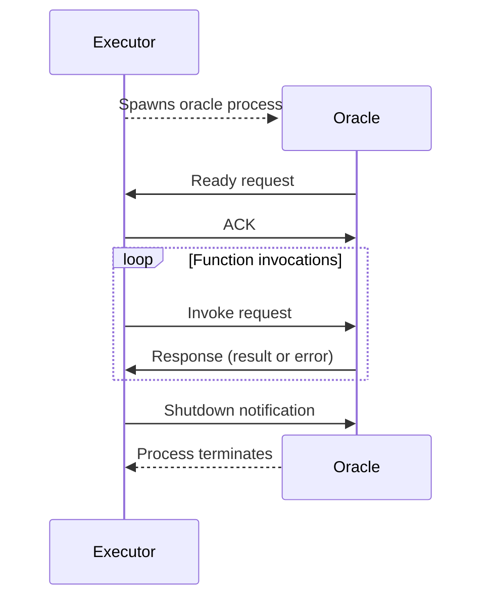

# `stdio` protocol <Badge type="warning" text="experimental" />

The `stdio` oracle protocol works by spawning subprocesses that talk a strict subset
of [JSON-RPC 2.0](https://www.jsonrpc.org/specification) over standard input/output.

## Connection string format

Oracles are invoked using connection strings with the following format:

```
stdio:<command>
```

Where `<command>` is the shell command to execute the oracle process. Arguments are delimited as in shell invocations,
and basic escape sequences are supported, but more complex features like environment variable expansions, pipes, and
redirections aren't.

#### Example

```cairo
oracle::invoke(
    "stdio:cargo -q run --manifest-path my_oracle/Cargo.toml",
    'selector',
    (param1, param2)
)
```

## General flow

The following sequence diagram provides a bird's eye view of this protocol's flow.



## Transport protocol

1. Oracle sends messages to its standard output.
2. Executor sends messages to oracle's standard input.
3. The first byte sent by the oracle must always be `{` (`0x7b`).
4. Messages in both directions **must always** fit in a single line.
5. Oracle can write its logs to standard error. Executor will include these lines in its own logs.

## Error handling

Oracle failure never halts program execution. Instead, failing invocations always return an `oracle::Error` object in
Cairo code. The internal structure of this type is opaque, but it can be displayed and (de)serialised.

## Process spawning

On the first invocation to a particular connection string, the executor spawns an oracle process using the specified
command.

Each unique connection string maintains a persistent process which is terminated when the executor ends. Failed
connections aren't cached and will retry on subsequent calls.

## Initialisation

The oracle process announces that it is ready to accept commands and waits for the executor for acknowledgement.

```jsonc
// oracle to executor
{"jsonrpc":"2.0","id":0,"method":"ready"}

// executor to oracle
{"jsonrpc":"2.0","id":0,"result":{}}
```

1. The `ready` method doesn't require any parameters to provide by the oracle nor any back in the result. It is possible
   that some optional parameters will be introduced in the future.
2. If the executor errors on this request, oracle must terminate.
3. The `id` is not fixed; it can be any value that is valid, according to JSON-RPC spec.
4. Executor will never send any data to the oracle until it receives `ready` request.

## Function invocation

Cairo program calls oracle functions via the `invoke` cheatcode. The executor translates this to `invoke` requests that
is sends to the oracle. Oracle responds with JSON-RPC responses containing results or errors. This step runs in a
synchronous loop throughout Cairo program execution.

```jsonc
// executor to oracle
{"jsonrpc":"2.0","id":0,"method":"invoke","params":{"selector":"f","calldata":["0x2710"]}}

// oracle to executor
{"jsonrpc":"2.0","id":0,"result":["0x5f5e100"]}

// executor to oracle
{"jsonrpc":"2.0","id":1,"method":"invoke","params":{"selector":"f","calldata":["0x2711"]}}

// oracle to executor
{"jsonrpc":"2.0","id":1,"error":{"code":-32603,"message":"error message"}}
```

1. The `selector` field specifies which oracle function to call.
2. Input/result data is always an array of hex-encoded Felt252 values that represent input/output as serialised by Cairo
   [Serde](https://www.starknet.io/cairo-book/appendix-03-derivable-traits.html?highlight=serde#serializing-with-serde).
3. This protocol doesn't specify custom error codes beneath ones specified by JSON-RPC.
4. Parallel/asynchronous function invocations are not possible.

## Termination

When the oracle process is no longer needed, the executor asks it to terminate gracefully.

```jsonc
// executor to oracle
{ "jsonrpc": "2.0", "method": "shutdown" }
```
