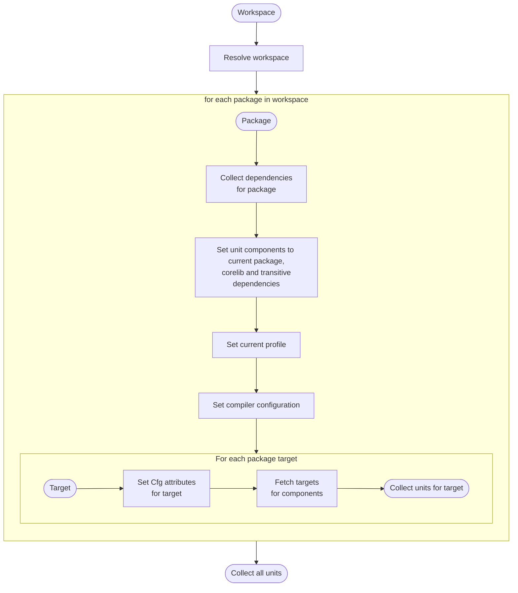

# Compilation Model

Scarb handles project compilation, using the Cairo compiler internally, producing the compilation targets requested in
the manifest file.

_Compilation unit_ is used during Scarb project compilation, in order to organize compilation process and encapsulate
all metadata required for the compilation.
_Compilation units_ are compiled separately, one by one.
Each _compilation unit_ produces a single compilation [target](./targets).

## Compilation unit structure

Compilation unit points to a single package deemed as main package that is being build, and a single compilation target
from that package.

Additionally, a compilation unit encapsulates following compilation metadata:

- packages on which the compilation unit depends, called compilation unit components
- name of the profile used for the compilation ([See more on `profiles` page](./profiles))
- compiler configuration parameters ([See more on `manifest` page](./manifest#cairo))
- conditional compilation attributes that should be enabled ([See more on `conditional compilation` page](./conditional-compilation))

The compilation unit structure is deemed non-exhaustive, which means that Scarb retains the right to extend it in the
future.
All software depending on this structure should assume that there more fields will be added.

## Scarb metadata

Compilation units for a project are exposed via Scarb metadata.
You can find more information on the exposed compilation unit structure on
[Scarb metadata](https://docs.rs/scarb-metadata/latest/scarb_metadata/struct.CompilationUnitMetadata.html) documentation page.

## Generating compilation units

_Compilation units_ are generated for each compilation target defined for each member package of a resolved Scarb
project workspace.

While generating _compilation units_ for a package, Scarb gathers all packages on which the main package depends,
including the main package itself, from the resolved workspace.
All library packages are passed as _compilation unit_ components.
The main package is always the first component of a corresponding _compilation unit_, while the second is reserved
for the Cairo core library.
Additionally, the name of the current profile and compiler configuration parameters are collected.

For each manifest defined target of the package, a set of conditional compilation arguments is collected.
From the list of components gathered before, compilation targets are extracted.
The _compilation unit_ is constructed from the described attributes.

Following diagram describes the process:

